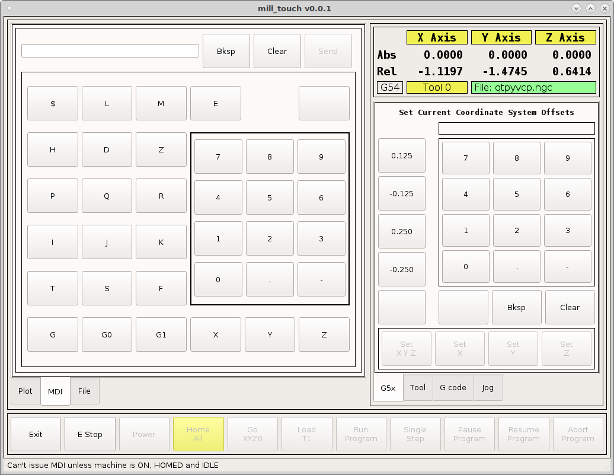
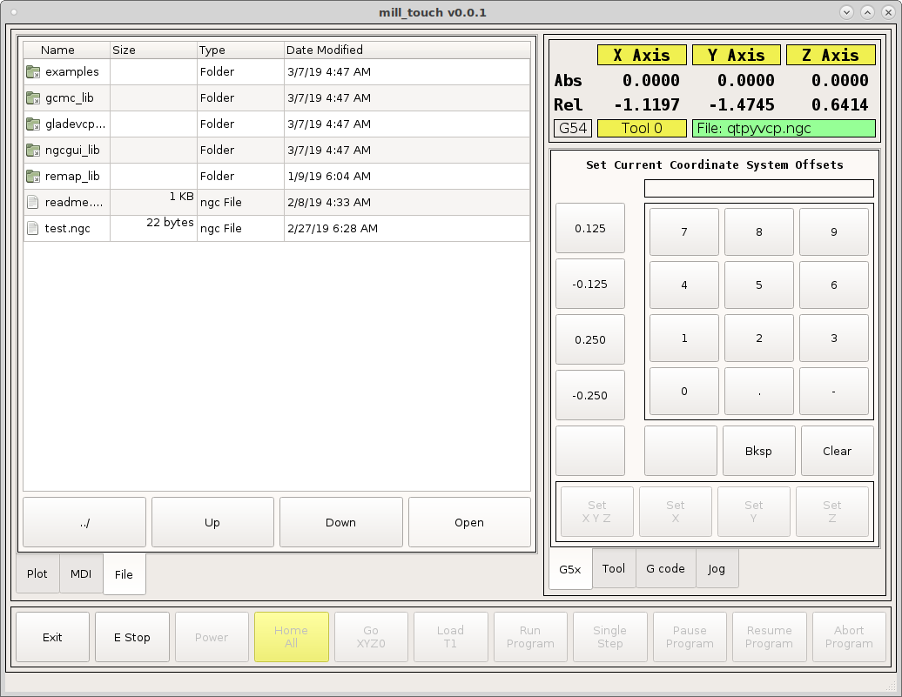
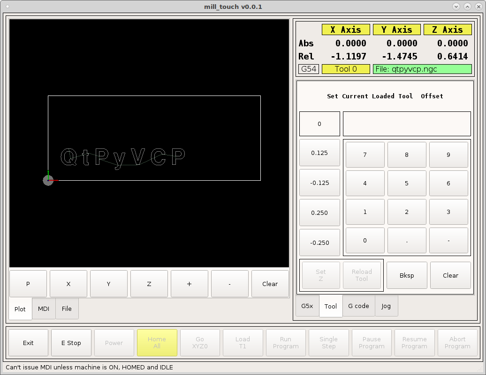
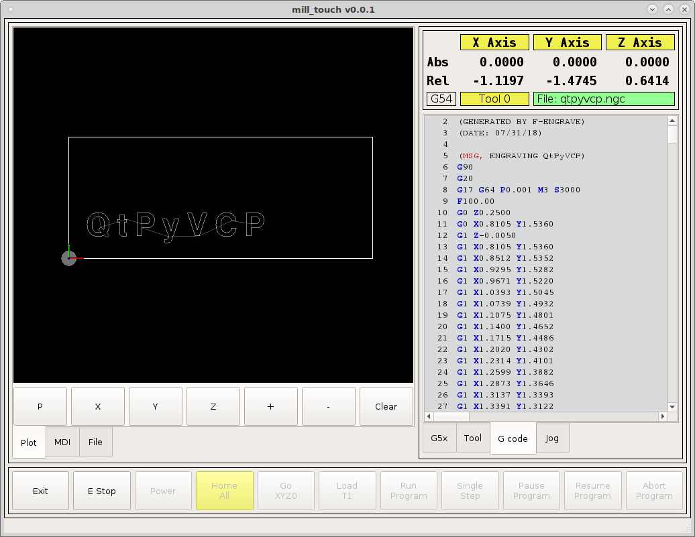
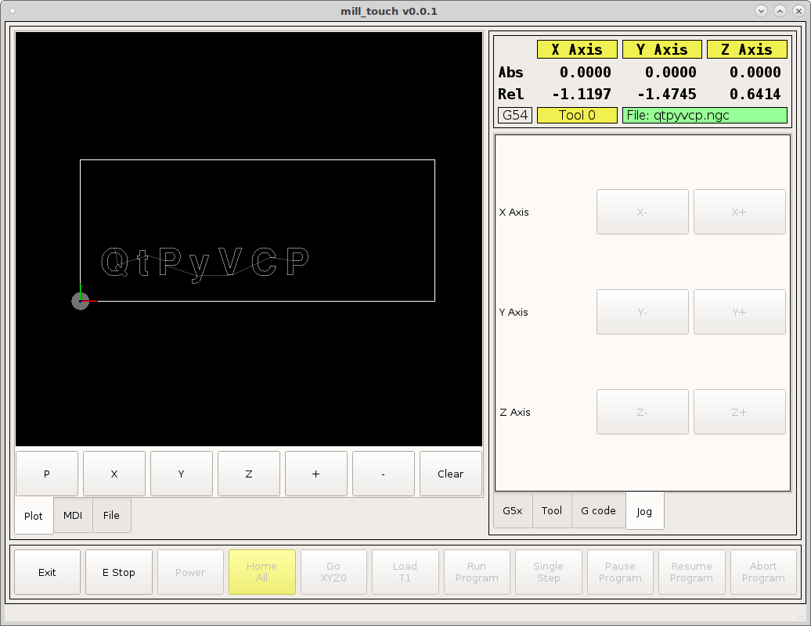

==========
Mill Touch
==========

A QtPyVCP interface for a 3 axis mill with a touch screen. I tried to layout
the screen to be as efficient as possible for me. Your needs may be different.

This interface uses the new VTK backplot which is a lot faster and more memory
efficient than Gremlin.

.. image:: images/mill-touch-01.png
   :align: center
   :scale: 60 %

